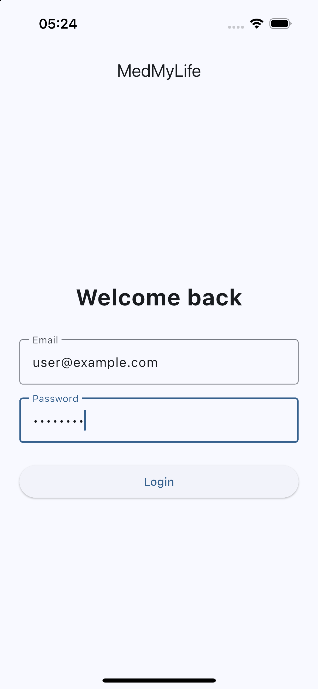
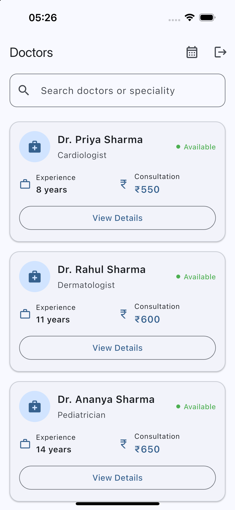
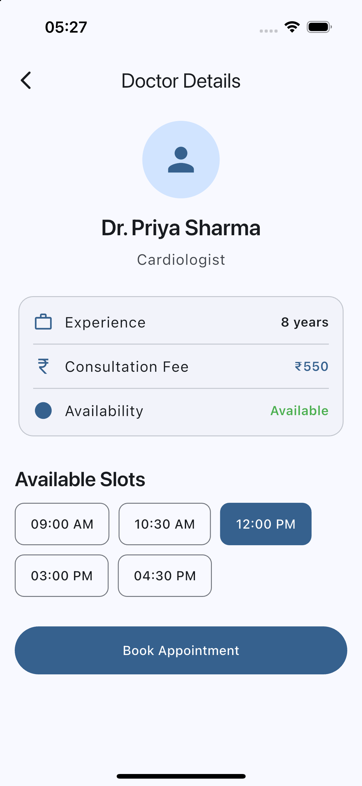
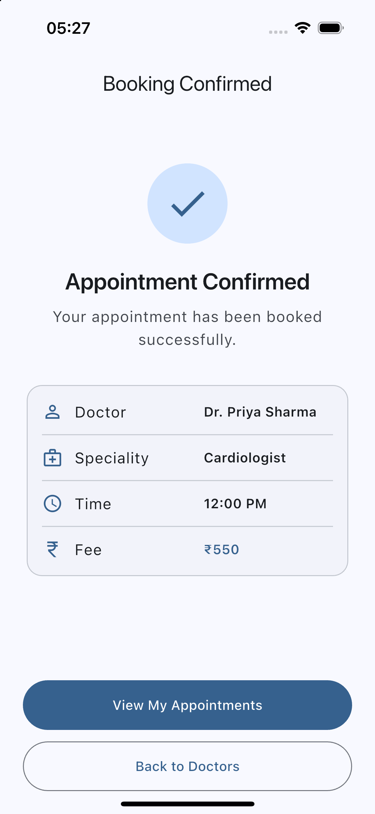
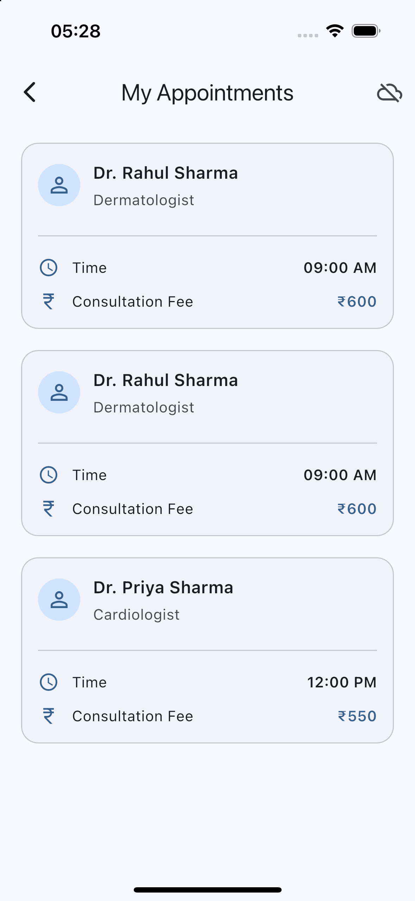
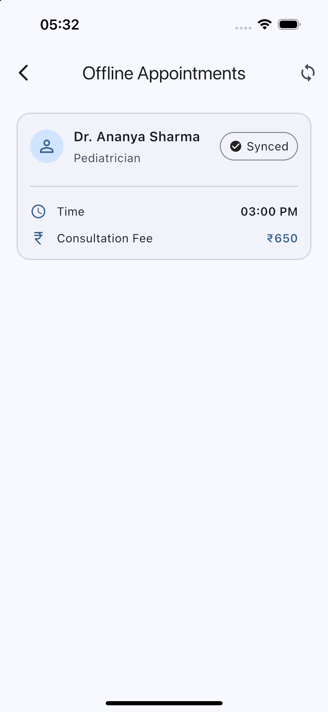

# Medmylife – Flutter Developer Technical Assignment

A simplified healthcare appointment management app built with Flutter.

## Tech Stack

- Flutter / Dart
- Riverpod
- Dio
- Drift / SQLite
- REST Mock API

## Versions

- **Flutter:** 3.47.5
- **Dart:** 3.13.4
- **DevTools:** 2.60.0

## Dependencies

- **Flutter Riverpod** – state management
- **Dio** – HTTP/API communication
- **Drift** – local SQLite database and offline caching
- **Email Validator** – login email validation
- **Path Provider** – application database/storage path
- **Shared Preferences** – local authentication state
- **Infinite Scroll Pagination** – doctor list pagination
- **Connectivity Plus** – network connectivity detection

### Development Dependencies

- **Flutter Test** – unit testing
- **Drift Dev** – Drift code generation
- **Build Runner** – code generation
- **Flutter Lints** – Dart/Flutter linting


## Features

- Mock login with validation
- Doctor listing from mock API
- Pagination and debounced search
- Pull-to-refresh
- Doctor details and appointment booking
- Booking loading/error/success states
- My Appointments
- Offline doctor caching with Drift
- Riverpod state management
- Repository and data-source abstraction


## Architecture

```text
UI
 ↓
Riverpod / Controllers
 ↓
Repository
 ↙        ↘
Remote     Local
API        Database
```

## Project Structure

```text
lib/
├── core/
├── features/
│   ├── auth/
│   ├── doctors/
│   └── appointments/
└── main.dart

test/
├── features/
│   ├── doctors/
│   └── appointments/
```


## Screenshots

### Login



### Doctor List



### Doctor Details



### Appointment



### My Appointments



### Offline Appointment Queue




## Demo Login

```text
Email: user@example.com
Password: password
```

Authentication is mocked for this assignment.


## Mock Repositories

Two appointment repositories are included intentionally:

- **Normal repository** – demonstrates successful booking.
- **Failed repository** – simulates booking API failure because no real appointment API is provided.

This allows both success and failure flows to be demonstrated without requiring a real backend.

## Offline Support

Doctors fetched from the API are cached using Drift.

If the API fails and cached doctors are available, the cached data is displayed.

On pull-to-refresh, the API is called again to fetch the latest data. The first 50 entries are fetched and the local cache is updated. Since no synchronization API is available to determine which doctors have been deleted, the local database is refreshed directly from the latest API response.


## Appointment Storage

Appointments are currently stored in memory because no real appointment backend is provided.

For production, appointments would be persisted locally and synchronized with the backend.


## Tests

Unit tests cover:

- Doctor JSON parsing
- Doctor repository success
- Doctor repository API failure with cache
- Doctor repository API failure without cache
- Appointment booking success
- Appointment booking failure

Run tests:

```bash
flutter test
```

## Run

To install dependencies
```bash
flutter pub get 
```

To generate Drift/code-generation files
```bash
dart run build_runner build --delete-conflicting-outputs
```

To run the app
```bash
flutter run
```

## Mock API

Base URL
```text
https://medmylife.netlify.app/api
```

Endpoint
```text
/doctors?limit=10&offset=0
/doctors/1
/doctors?q=cardiologist
```

## APK

The Android APK is included in the repository:
[Download Android APK](https://github.com/iambhargavnath/medmylife/releases/download/1.0.0/app-release.apk)


## Production Improvements

- Real authentication and token refresh
- Real appointment API
- Persistent appointment storage
- Background synchronization and retry
- Server-side booking conflict handling
- Expanded test coverage

## Author

**Bhargav Nath**

Mobile App Developer

- GitHub: [github.com/iambhargavnath](https://github.com/iambhargavnath)
- LinkedIn: [LinkedIn Profile](https://www.linkedin.com/in/iambhargavnath/)
- Email: [iambhargavnath@gmail.com](iambhargavnath@gmail.com)

